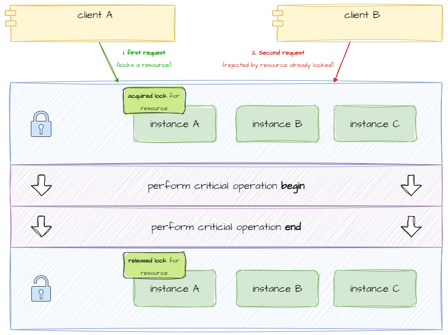

# go-distributed-lock

## Introduction
This project is an example related to [distributed lock manager](https://en.wikipedia.org/wiki/Distributed_lock_manager) implemented in Golang using Redis and redis-sync.



## Prerequisites
- Golang 1.22 or higher
- Docker
- Postman (optional, for testing)

## How can I test it?

To run the project using Docker execute the following command from the root of the project:
```bash
docker compose up
```

You can test the project using the included Postman collection: `doc/go-distributed-lock.postman_collection.json`. Or you can use the following
CURLs:

- **Lock resource request:**
In this example, two requests are made to acquire a lock for the same resource (my-test-key). The second request simulates a re-attempt to acquire the lock while it is already held by the first request.

1. 
```bash
curl --location 'http://localhost:8081/lock?resource_id=my-test-key'
```

1. 
```bash
curl --location 'http://localhost:8082/lock?resource_id=my-test-key'
```

You will see logs like:

```
# Log from the first node successfully acquiring the lock
go-distribuited-lock-web-1 | 2024/10/19 19:50:14 Lock acquired for resource my-key-1, performing critical operation

# Log from the second node failing to acquire the lock
go-distribuited-lock-web-2 | 2024/10/19 19:50:24 Error: Failed to acquire lock for resource my-key-1: lock already taken, locked nodes: [0]
go-distribuited-lock-web-2 | [GIN] 2024/10/19 - 19:50:24 | 500 | 4.719088348s | 172.19.0.1 | GET "/lock?resource_id=my-key-1"
go-distribuited-lock-web-2 | 2024/10/19 19:50:31 Error: Failed to acquire lock for resource my-key-1: lock already taken, locked nodes: [0]
go-distribuited-lock-web-2 | [GIN] 2024/10/19 - 19:50:31 | 500 | 4.545097361s | 172.19.0.1 | GET "/lock?resource_id=my-key-1"

# First node releases the lock after completing the operation
go-distribuited-lock-web-1 | 2024/10/19 19:50:45 Critical operation completed for resource my-key-1
go-distribuited-lock-web-1 | 2024/10/19 19:50:45 Lock released for resource my-key-1
go-distribuited-lock-web-1 | [GIN] 2024/10/19 - 19:50:45 | 200 | 30.026678546s | 172.19.0.1 | GET "/lock?resource_id=my-key-1"

# Second node successfully acquires the lock after the first node releases it
go-distribuited-lock-web-2 | 2024/10/19 19:50:51 Lock acquired for resource my-key-1, performing critical operation
go-distribuited-lock-web-2 | 2024/10/19 19:51:21 Critical operation completed for resource my-key-1
go-distribuited-lock-web-2 | 2024/10/19 19:51:21 Lock released for resource my-key-1
go-distribuited-lock-web-2 | [GIN] 2024/10/19 - 19:51:21 | 200 | 30.027426144s | 172.19.0.1 | GET "/lock?resource_id=my-key-1"
```

Also you can use redis insight to see how redis manage the distributed lock. You can go to http://localhost:5540/, and then click on "+ Add Redis database". Fill in the connection details as follows:

```bash
host=redis 
port=6379
password=password
```

Then click on "Test connection" and you would see "Connection is successful". After that go to the profiler tool by selecting the connection previously added. And repeat the process explained in the section "How can I test it?". For example, you may see logs like this (check database 1: `1 172.19.0.5:56280`):

```bash
00:41:32.814 [0 172.19.0.2:54782] "info"
00:41:43.091 [1 172.19.0.5:56280] "set" "lock:my-test-key" "lfRfarpA+W0e16dYV0/cvg==" "ex" "30" "nx"
00:41:47.819 [0 172.19.0.2:54782] "info"
00:41:58.102 [1 172.19.0.5:56280] "evalsha" "e950836ed1e694540c503ef9972b8de518044d3b" "1" "lock:my-test-key" "lfRfarpA+W0e16dYV0/cvg=="
00:41:58.102 [1 lua] "GET" "lock:my-test-key"
00:41:58.102 [1 lua] "DEL" "lock:my-test-key"
```

